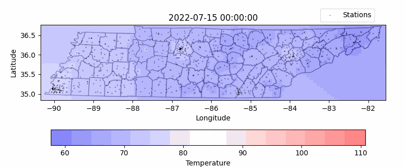

# Tennessee Tempature

# Methodology

## Data Collection

Weather data collected from [Weather API](www.weatherapi.com). Registration is free and quick, and services are well documented. I highly recommend this service.

Source code for fetching data can be found in the _fetch_data_ folder, which simply fetches weather data for many Tennessee zip codes.

## Interpolation

Temperature values used to create the heatmap are calculated via an Inverse Distance Weighting algorithm. In this case the square of the distance is used. Interpolation source code can be found in the _interp_ folder

## Plotting

For this project, high accuracy is not necessary, so logitudes and latitudes are treated as simple cartesian coordinates. Given that this analysis is only applied to a single state (a small area), the distortion from most map projections is small. Thus for our purposes catesian coordinates stacked on top of an image of the state will suffice. It would be very easy to pick this work up later to actually apply a map projection to the data and/or utilize some geographic plotting tool.
